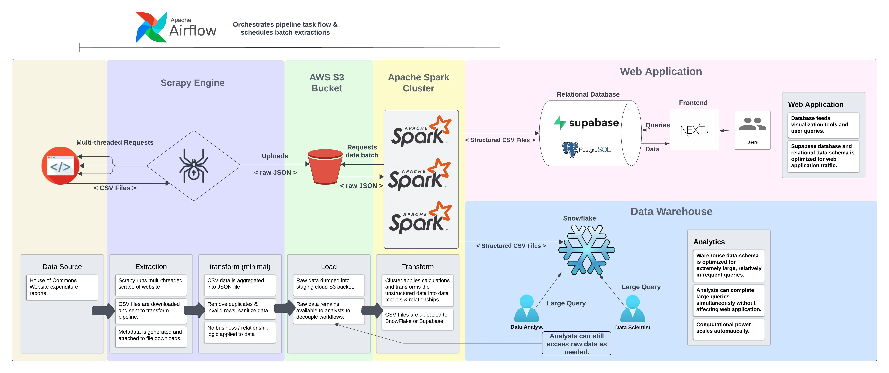

<h1 style="text-align: center;">The Legislator Ledger</h1>

This project tracks and aggregates thousands of expenditure reports for individual Members of Parliment into an accessible dataset. Under analysis, estimations of flight frequency and carbon emissions are made as an example use-case.

**The full dataset is found in expenditures.zip**.

Members of Parliment are required to report their travel, hospitality, and third-party contract expenditures as outlined [here](https://www.ourcommons.ca/en/open-data#ExpendituresMembers).

The expenditure reports of individual members of parliment are organized by quarter and year, with each report available for download on 12000+ seperate webpages - this is prevents meaningful aggregation and analysis of information that should be easily available to the public.

This extraction system aggregates and structures 1,000,000+ expenditures, from 12,000+ seperate expenditure reports into a dataset found in expenditures.zip. The dates range from July 1, 2020 to April 2024.


---

<h2 style="text-align: center;">System Architecture</h2>




Note that the tools used in this project were not chosen based on what is most practical. Apache Airflow, Apache Spark, and Snowflake are all a little overkill for this size of dataset, but I wanted to become more familar with these tools.

<h2 style="text-align: center;">Expenditures Dataset Schema</h2>

This dataset is scraped from the pages found [here](https://www.ourcommons.ca/ProactiveDisclosure/en/members).

More information on Member of Parliament expenditures and travel points system can be found [here](https://www.ourcommons.ca/Content/MAS/mas-e.pdf).

Each expenditure item contains a travel, hospitality, or a contract claim. The basic expenditure item is structured as such:

```js
    "category": {
        "anyOf": [
            "Travel", 
            "Hospitality", 
            "Contract"
            ],
        "type": "string",
        "description": "Hospitality events are meals, receptions, and other events hosted by the legislator. Travel events are trips claimed by the MP office. Contract events are third party services provided to the office."
    },
    "year": {
        "type": "integer",
        "description": "Year of expenditure"
    },
    "quarter": {
        "maximum": 4,
        "minimum": 1,
        "type": "integer",
        "description": "The fiscal quarter of the expenditure.
                        Q1 -> April 1-June 30
                        Q2 -> July 1-Sept 30
                        Q3 -> Oct 1-Dec 31
                        Q4 -> Jan 1-Mar 31"
    },
    "mp_id": {
        "type": "UUID",
        "description": "Each member of Parliament is assigned a unique identifier on the House of Commons website.",
        "required": false
    },
    "download_url": {
        "type": "string",
        "description": "Reference to the original data source. Note that the year present in the url is off by one year."
    },
    "csv_title": {
        "type": "string",
        "description": "Original csv title from data source"
    },
    "extracted_at": {
        "format": "date-time",
        "type": "string"
    },
    "institution": {
        "anyOf": [
            "Presiding Officers and House Officers",
            "Members",
            "House of Commons Administration",
            "Parliamentary Committees",
            "Parliamentary Diplomacy"
        ],
        "type": "string",
        "description": "The government body the legislator represented during the expenditure."
    },
    "caucus": {
        "anyOf": [
            "Conservative",
            "Liberal", 
            "New Democratic Party", 
            "Bloc Québécois", 
            "Green Party", 
            "Independent", 
            "Administration"
        ],
        "type": "string",
        "description": "The political caucus of the MP. 'Administration' is for expenses relating to non-partisan government bodies"
    },
    "name": {
        "type": "string",
        "description": "Name of the legislator in the format 'Lastname, Firstname'"
    },
    "constituency": {
        "type": "string",
        "description": "The political constituency the legislator represents.",
        "required": false
    },
    "claim": {
        "anyOf": [
            "@CONTRACT CLAIM",
            "@HOSPITALITY CLAIM",
            "@TRAVEL CLAIM"
        ],
        "type": "object",
        "description": "Schema for each claim type outlined below."
    }

```
<h3 style="text-align: center;">Contract Claim</h2>

A contract claim is a third party service or product that was purchased by the MP office. These include products such as office supplies, advertising, software products, etc. 

```js
    "supplier": {
        "type": "string",
        "description": "The third party providing the contract service."
    },
    "description": {
        "type": "string",
        "description": "The description of the contract service."
    },
    "date": {
        "format": "date",
        "type": "string",
        "description": "Date the contract was signed."
    },
    "total_cost": {
        "type": "decimal",
        "minimum": 0
    }
```
<h3 style="text-align: center;">Hospitality Claim</h2>

Hospitality event expenditures are events that the legislator hosts. These include staff events, ceremonies, dinners, etc.

```js
    "claim_id": {
        "type": "string",
        "description": "Unique identifier for the claim."
    },
    "date": {
        "format": "date",
        "type": "string"
    },
    "location": {
        "type": "string"
    },
    "num_attendees": {
        "type": "integer"
    },
    "purpose_of_hospitality": {
        "anyOf": [
            "To meet visitors of Member’s office", 
            "To attend staff events including training", 
            "To discuss constituency issues with stakeholders", 
            "To discuss business of the House, caucus and committees",
            "To plan Member's priorities and activities", 
            "To exchange with dignitaries", 
            "To meet constituents", 
            "To celebrate a significant event"
            ],
        "type": "string"
    },
    "event_type": {
        "anyOf": [
            "Community activity or event", 
            "Hosting a reception or open house", 
            "Hosting a meeting", "Gala, reception or ceremony", 
            "Meal at a gala, reception or ceremony", 
            "Meal at a community activity or event", 
            "Hosting a town hall or community event", 
            "Hosting a staff event"
            ],
        "type": "string"
    },
    "supplier"{ 
        "type": "string",
        "description": "Catering company or third party that provided services/food for th event"
    },
    "total_cost": {
        "type": "decimal",
        "minimum": 0
    }
```
<h3 style="text-align: center;">Travel Claim</h2>

For more information regarding the travel points system, please reference chapter 6, page 5 of the [Members' Allowances and Services Document](https://www.ourcommons.ca/Content/MAS/mas-e.pdf).

```js
"claim_id": {
    "type": "string",
    "description": "Unique identifier for the claim."
},
"transport_cost": {
    "type": "decimal",
    "minimum": 0,
    "description": "Total cost of transportation (flights and otherwise) across all travel events in claim. Flight costs are still recorded even if travel points are used."
},
"accommodation_cost": {
    "type": "decimal",
    "minimum": 0,
    "description": "Total cost of meals and incidentals across all travel events in claim."
},
"meals_and_incidentals_cost": {
    "type": "decimal",
    "minimum": 0,
    "description": "Total cost of meals and incidentals across all travel events in claim."
},
"reg_points_used": {
    "multipleOf": 0.5,
    "minimum": 0,
    "type": "decimal",
    "description": "Regular points used across all travel events in claim. Each member is given a minimum 64 travel points per year to complete their parlimentary duties. 0.5 travel points is a one way flight."
},
"special_points_used": {
    "multipleOf": 0.5,
    "minimum": 0,
    "type": "decimal",
    "description": "25 of the 64 travel points can be allocated to domestic flights outside of the restrictions of regular points."
},
"USA_points_used": {
    "multipleOf": 0.5,
    "minimum": 0,
    "type": "decimal",
    "description": "4 of the 64 travel points each year can be used to travel to Washington DC or New York City."
},
"travel_events": {
  "type": "array",
  "items": {
    "traveller_name": {
      "type": "string",
      "description": "Name of the traveller. Note that this is not always the MP.",
      "required": false
    },
    "traveller_type": {
      "anyOf": [
        "Member",
        "Designated Traveller",
        "Employee",
        "Dependant",
        "House Officer Employee",
        "Parliamentary Intern",
        "House Officer"
      ],
      "type": "string"
    },
    "purpose_of_travel": {
      "anyOf": [
          "To attend training",
          "To attend an event as a matter of protocol",
          "To attend meetings in Washington D.C",
          "Meals and Incidentals",
          "To attend meetings about constituency issues",
          "To attend a constituency or community event",
          "To support a House Officer's functions",
          "To support a parliamentary exchange",
          "To attend a conference",
          "To attend language training",
          "To represent the Member at an event",
          "To conduct constituency office business",
          "Trip cancellation expenses due to unforeseen circumstance",
          "Maple Leaf Lounge",
          "Transportation",
          "To attend a regional or provincial caucus meeting",
          "To attend a national caucus meeting",
          "To unite the family with the Member",
          "To attend an authorized funeral",
          "Attending event with Member",
          "To participate in a government program initiative",
          "To attend an event as a guest speaker",
          "To support a parliamentary association",
          "To attend meetings with United Nations’ officials in New York City",
          "To support a parliamentary committee",
          "Secondary Residence",
          "To drive Member to/from terminal",
          "To attend meetings with stakeholders about business of the House",
          "To attend a constituency event",
          "To support the House Officer",
          "To support the Member responsible of the National Caucus Research Office",
          "To attend an event",
          "To attend a business meeting",
          "To travel to/from constituency and Ottawa",
          "Accommodation"
        ],
        "type": "string"
    }
  },
  "date": {
    "format": "date",
    "type": "string",
    "description": "Date of departure"
  },
  "departure": {
    "type": "string",
    "description": "Departure location for the journey"
  },
  "destination": {
    "type": "string",
    "description": "Destination location for the journey"
  }
}
```
